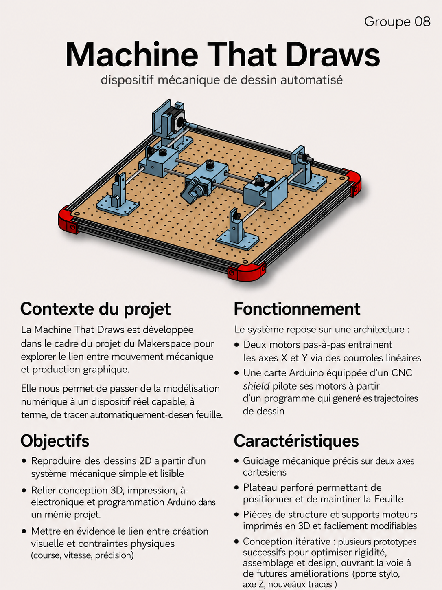

# Bienvenue sur notre documentation
Bienvenue dans la documentation du projet XY. Ce site a pour but de fournir toutes les informations nécessaires pour comprendre, utiliser et reproduire efficacement notre projet.

[Notre projet sur Onshape](https://cad.onshape.com/documents/e895d617fa85e3b715768f5c/v/efa0b0bc12fe522d979fde8b/e/5e27dc6e7103b2e81bcf4c4e){: .btn .btn-primary .fs-5 .mb-4 .mb-md-0 .mr-2 }
[Notre repo GitHub](https://github.com/Makerspace-Amiens/2026-MachineThatDraws-Groupe08){: .btn .fs-5 .mb-4 .mb-md-0 }

<iframe height="600" width="100%" src="https://modelembedder.net/embed?did=e895d617fa85e3b715768f5c&wvm=v&wvmid=efa0b0bc12fe522d979fde8b&eid=5e27dc6e7103b2e81bcf4c4e&elementType=ASSEMBLY" frameborder="0"></iframe>

{: .warning }
>Pour intégrer la visualisation de votre projet Onshape, utilisez le site https://modelembedder.net . Activez le partage par lien via l'outil de partage de Onshape. n'oubliez pas d'activer l'option "export". Puis completez l'iframe ci-dessus avec le lien généré par le site https://modelembedder.net. Vous pouvez mettre à jour également le bouton avec le lien de partage de votre modèle.

## À propos du Projet

Machine That Draws est un projet de conception et de prototypage réalisé dans le cadre du Makerspace d’UniLaSalle Amiens. Notre objectif est de développer une machine cartésienne capable de dessiner automatiquement sur une feuille à l’aide de moteurs pas-à-pas, d’une carte de commande et d’un système de pilotage programmable. D’après votre site, les sections prévues présentent les objectifs, les choix techniques, la conception, le prototypage et les étapes de fabrication, ce qui correspond bien à une documentation de projet reproductible.

Ce projet nous permet de relier plusieurs domaines complémentaires : modélisation 3D, électronique, programmation et fabrication. La machine repose sur un déplacement selon deux axes X et Y, afin de tracer des formes, motifs ou dessins de manière précise et automatisée. L’idée n’est pas seulement d’obtenir un prototype fonctionnel, mais aussi de comprendre toute la démarche d’ingénierie, depuis le besoin initial jusqu’aux tests et aux améliorations successives.

Cette documentation a pour but de présenter notre démarche, nos choix de conception, les composants utilisés et les différentes étapes de réalisation. Elle doit permettre à n’importe quelle personne intéressée de comprendre le fonctionnement de la machine, suivre son développement et éventuellement la reproduire. Votre page d’accueil indique déjà cette intention de “comprendre, utiliser et reproduire efficacement” le projet, donc ce texte s’intègre bien à l’esprit du site.

## Poster

Ici vous publierez le poster de votre projet.

## Vidéo

Ici vous publierez la vidéo de votre projet. 
- 1min30 au format vertical
- Présentation du projet 
- Des explication du fonctionnement du projet
- Des vues du projet / Prototype / Application etc... 
- Des plans du fonctionnement (même basique ou des éléments séparés)
- Une conclusion
- Si en stockage local : <50mo

<video src="images/intro_amiens.mp4" controls title="Title"  style="width: 100%;"></video>

---
